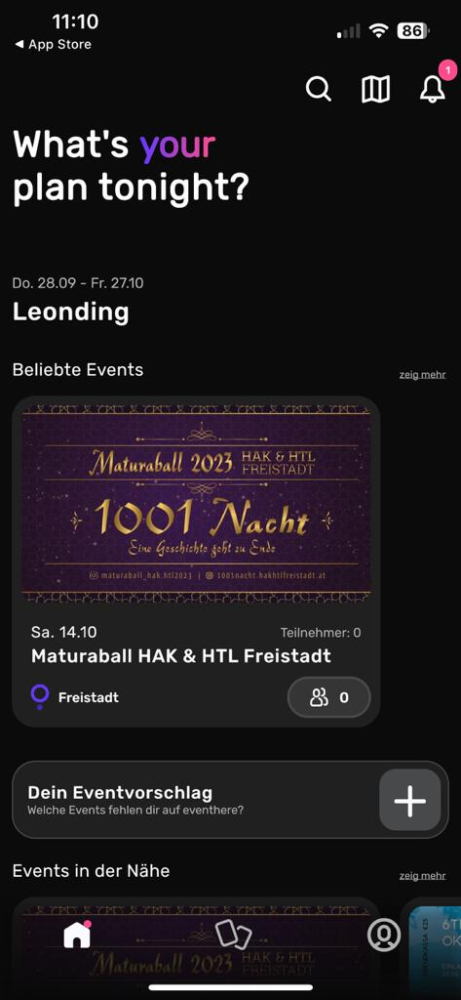
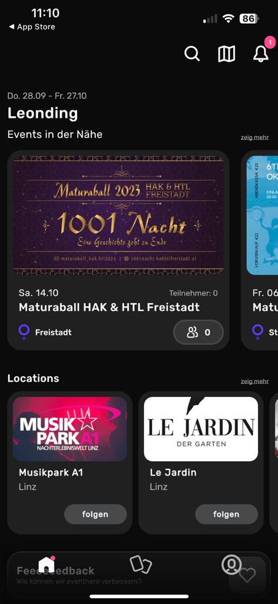
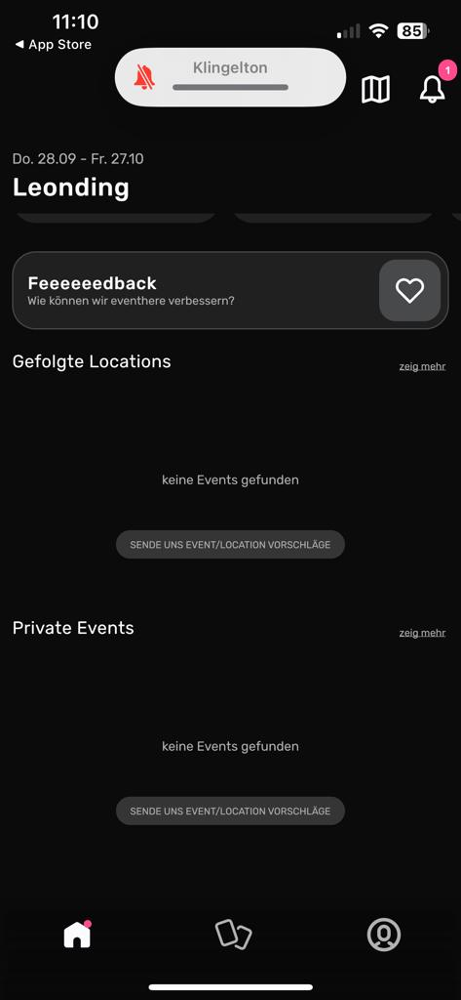
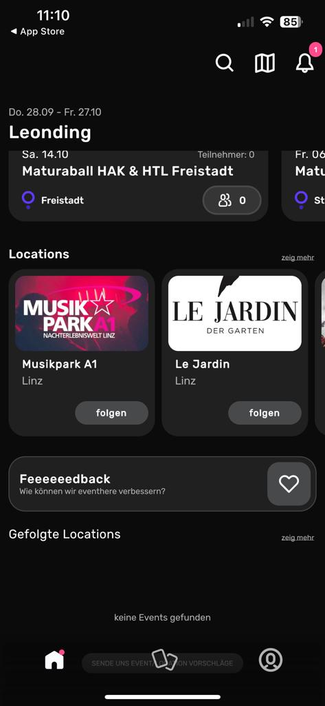
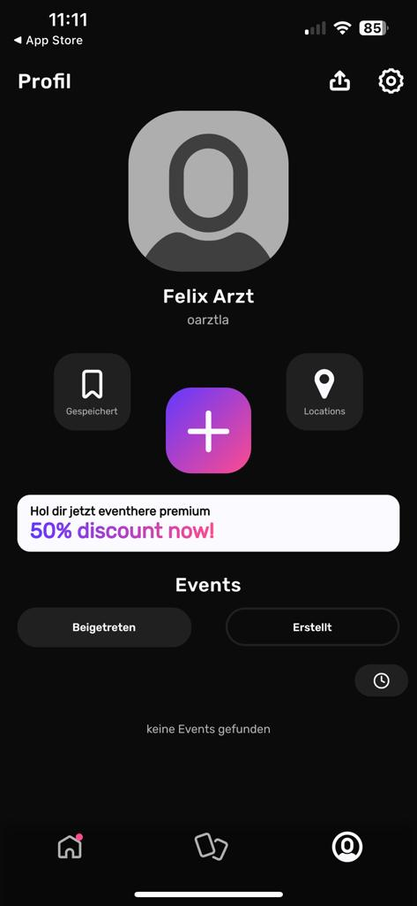
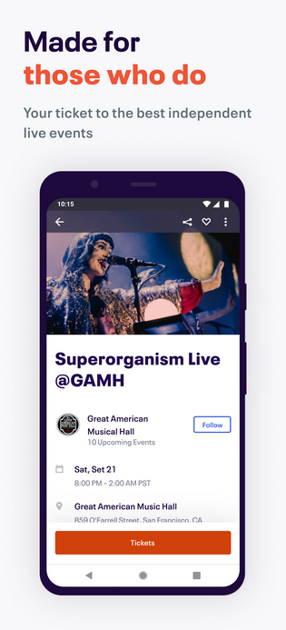
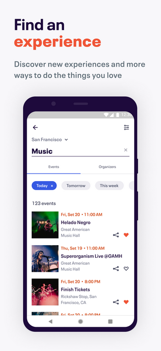
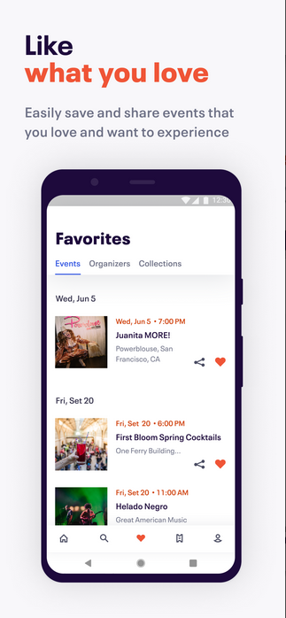
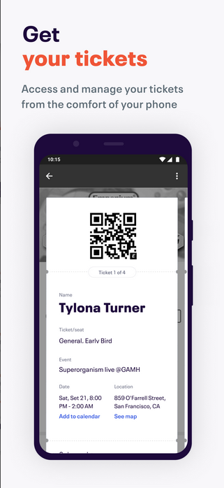

# Marktanalyse
 
## Eventhere

* Marktsegment: Eventhere ist eine App für die Party- und Eventwelt. Entdecke die besten Partys & lerne neue Leute kennen. Informiere dich über Events, sieh wer teilnimmt und tretet selbst bei oder veranstalte deine eigenen Events.

* Nutzerbasis: Eine Analyse der Nutzerbasis von Eventhere, darunter Organisatoren von Veranstaltungen und Nacht-Clubs und Partyleute.

* Einnahmequellen: Eventhere generiert Einnahmen durch ihre Premium-Version die zusätzliche Tools anbietet.

* Wettbewerb: Ist eine der wenigen Apps in der Eventmanagement-Branche die eine Social Media funktion hat.

UI und UX: Das ganze Design wird sehr schlicht im Darkmode gehalten. Die ganzen Events sind nebeneinander und nicht untereinander angeordnet, das macht das alles ein bisschen ansprechender. Die ganze Aufteilung der Events oder Locations ist generell gut realisiert worden und man ersparrt sich damit eine eigene View und alles. 

 
 
 
 
 
 

## Eventbrite:

* Marktsegment: Eventbrite bedient vor allem Veranstaltungsorganisatoren, die Tickets für Veranstaltungen aller Art verkaufen möchten, von Konzerten über Konferenzen bis hin zu Sportveranstaltungen.

* Nutzerbasis: Eine Analyse der Nutzerbasis von Eventbrite, darunter Organisatoren von Veranstaltungen und Ticketkäufer.

* Einnahmequellen: Eventbrite generiert Einnahmen durch Gebühren für Ticketverkäufe und eventuell auch durch zusätzliche Dienstleistungen wie Event-Management-Tools.

* Wettbewerb: Eine Bewertung der Wettbewerber in der Ticketing- und Eventmanagement-Branche, einschließlich anderer Plattformen und Ticketing-Dienstleister.

UI und UX: Das ganze Design wird sehr schlicht gehalten, es schaut aus ein bisschen aus wie eine Music Streaming Plattform. Die ganze Aufteilung Seite ist mehrfach unterteilt womit man mehrere Views benötigt. Die Suchfunktion ist sehr umfangreich und auch schön gestaltet. Das große Plus an der App ist, dass es ein Ticketverkauf-System gibt mit Qr-Code.

 
 
 
 
 
 
 
 
