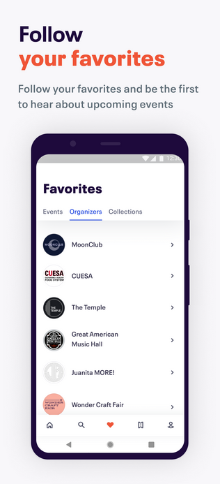

# Marktanalyse
 
## Eventhere

* Marktsegment: Eventhere ist eine App für die Party- und Eventwelt. Entdecke die besten Partys & lerne neue Leute kennen. Informiere dich über Events, sieh wer teilnimmt und tretet selbst bei oder veranstalte deine eigenen Events.

* Nutzerbasis: Eine Analyse der Nutzerbasis von Eventhere, darunter Organisatoren von Veranstaltungen und Nacht-Clubs und Partyleute.

* Einnahmequellen: Eventhere generiert Einnahmen durch ihre Premium-Version die zusätzliche Tools anbietet.

* Wettbewerb: Ist eine der wenigen Apps in der Eventmanagement-Branche die eine Social Media funktion hat.

 
 
 
 
 
 

## Eventbrite:

* Marktsegment: Eventbrite bedient vor allem Veranstaltungsorganisatoren, die Tickets für Veranstaltungen aller Art verkaufen möchten, von Konzerten über Konferenzen bis hin zu Sportveranstaltungen.

* Nutzerbasis: Eine Analyse der Nutzerbasis von Eventbrite, darunter Organisatoren von Veranstaltungen und Ticketkäufer.

* Einnahmequellen: Eventbrite generiert Einnahmen durch Gebühren für Ticketverkäufe und eventuell auch durch zusätzliche Dienstleistungen wie Event-Management-Tools.

* Wettbewerb: Eine Bewertung der Wettbewerber in der Ticketing- und Eventmanagement-Branche, einschließlich anderer Plattformen und Ticketing-Dienstleister.

 
 
 
 
 
 
 
 