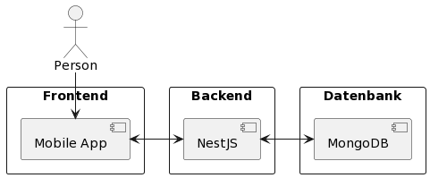

= Connecting Memories

ifndef::imagesdir[:imagesdir: ../images]
:icons: font
:stylesheet: style.css
:stylesdir: style

== Was ist Connecting Memories?

Ein Tool zum Finden, Organisieren und Promoten von öffentlichen und privaten Veranstaltungen

== Problem

* Man möchte auf eine Veranstaltung gehen, weiß allerdings nicht welche in seiner Nähe sind
* Möchte eine private Feier veranstalten, braucht um alle Eingeladenen zu erreichen verschiedene Apps
* Werbung machen für Veranstaltungen ist teuer und aufwendig

== Wie funktioniert Connecting Memories?

== Vielen Dank für Ihre Aufmerksamkeit
